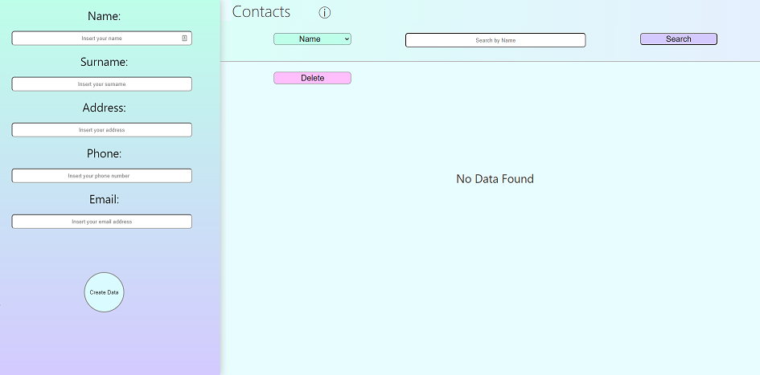

Contacts App
===

Main Features:
---

**Create Your Contact**
* Name
* Surname
* Address
* Phone Number
* Email

(*If the contact "Already Exists" You will be unable to add it into the database.*)

**Interactive Info Box**
Write add and select ... Info box will help you understand! :)

**Searching Contacts**
Through the search form, you can filter your contacts by name, surname, address, phone or email and getting so the filtered list.

**Searching with `CONTACTS`**
You can type `CONTACTS` to receive the complete list.
By selecting the search criteria and typing `CONTACTS`, the app will display all the entire contact list in alphabetical order for the selected search criteria.

**Delete Contact Function**
You can delete any contact from database by clicking the *Prevent deletion button*, once selected, you just have to click the **x** and the contact card is deleted... forever!

(*If the button is not selected, don't worry, the app will remind you*)

**`console.log()` Integrated**
For each important action you take, or you don't, you can just show it on your browser inspect tool.

Technical Features:
---

**Development**
This is a MERN app, developed entirely using *Mongoose*, *MongoDB*, *Express()*, *React.js* and *Node.js*. and I used *axios* for frontend and backend communication.
*Nodemon* packages are installed.

if you want to download and use this code remember to connect your *MongoDB* database through the server.js file, create your .env file and add your MONGO_URI.

(***Bash Scripting***)
*npm start*
*cd backend && nodemon server*

Appearance:
---

**CSS Responsive & Customized**
No package, this CSS file was created only for this App. Although responsive it is a basic file.

**Appearance of the App**

Conclusions:
---

This project was created solely for training, during a targeted study path, after having performed basic programming courses.
The purpose of the development of this application was to implement all the subjects of the course of study, thus reviewing the fundamental principles of MERN development.
I conclude with a heartfelt thanks to all those who are helping me to achieve and complete my studies. Thank you!